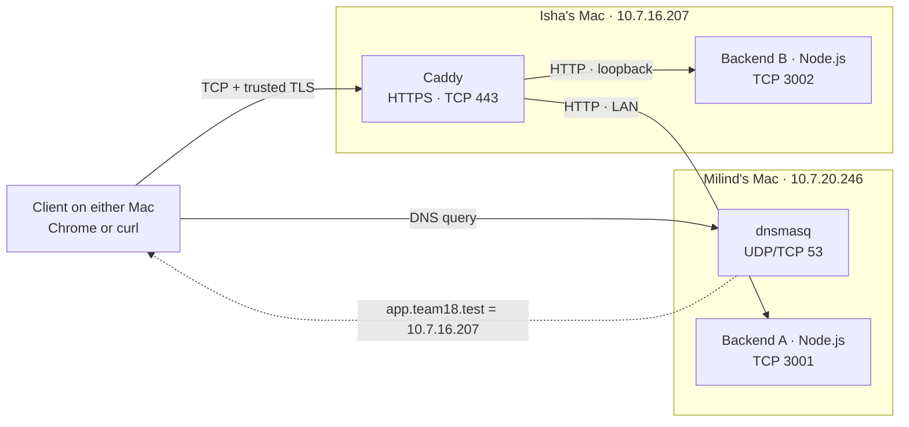

# Team 18 · Computer Networks Project

A private HTTPS service running across two Macs. A request travels the full
path: **DNS → TCP → TLS → reverse proxy → Backend A or B**, with cache
revalidation and failure handling.

| Member | Responsibilities |
| --- | --- |
| Milind | Backend A, dnsmasq (DNS), client verification |
| Isha | Backend B, Caddy HTTPS reverse proxy, certificates |

Both backends are Node.js standard-library HTTP servers, so the application
needs no npm packages. Caddy provides HTTPS and load balancing.

## Architecture



TLS ends at Caddy. Caddy opens a separate HTTP connection to the selected
backend. Each Mac has a domain-specific macOS resolver for `team18.test`, so
other domains keep using the normal network DNS.

See the [architecture guide](docs/architecture.md) for the request sequence.

## Network addresses

| Host | Address | Service | Port |
| --- | --- | --- | --- |
| Milind's Mac | `10.7.20.246` | dnsmasq | UDP/TCP 53 |
| Milind's Mac | `10.7.20.246` | Backend A | TCP 3001 |
| Isha's Mac | `10.7.16.207` | Caddy | TCP 443 |
| Isha's Mac | `10.7.16.207` | Backend B | TCP 3002 |

The Macs receive their addresses by DHCP. If an address changes, update the
DNS record and the Caddy upstream to match. Caddy reaches Backend B at
`127.0.0.1:3002` because both run on the same Mac. See
[DNS setup](docs/dns-setup.md).

## Services

### DNS

[dnsmasq-team18.conf](phase1/configs/dnsmasq-team18.conf) serves one record:

```text
app.team18.test → 10.7.16.207
```

It listens on Milind's loopback and LAN addresses and forwards all other
names to `8.8.8.8`. Each Mac's `/etc/resolver/team18.test` contains:

```text
nameserver 10.7.20.246
```

The project hostname must resolve through DNS; an `/etc/hosts` entry would
bypass the DNS exchange.

### Backends

| Request | Backend A | Backend B |
| --- | --- | --- |
| `GET /` | `Hello from Backend A` | `Hello from Backend B` |
| `GET /api/status` | `{"status":"ok","backend":"A"}` | `{"status":"ok","backend":"B"}` |
| `GET /api/cache` | Cacheable body, A's ETag | Cacheable body, B's ETag |
| Matching `If-None-Match` on `/api/cache` | `304`, empty body | `304`, empty body |
| Unknown route | `404` | `404` |

Each backend adds its own `X-Backend` header. The cache endpoint sends
`Cache-Control: max-age=60`. A and B have different bodies and ETags, so a
validator from B can return `304` on B and `200` on A.

Start each backend from the repository root:

```sh
node phase1/backend/backend-a.js   # Backend A, port 3001
node phase1/backend/backend-b.js   # Backend B, port 3002
```

Run the tests:

```sh
node --test phase1/backend/*.test.js
```

See [backend details](phase1/backend/README.md).

### HTTPS and load balancing

The [Caddyfile](phase1/configs/Caddyfile) selects Backend A or B by round
robin, checks `/api/status` every two seconds, and retries failed upstream
connections for up to two seconds. Clients verify the certificate normally,
without bypassing verification. See [TLS and proxy setup](docs/tls-setup.md).

## Repository structure

```text
.
├── README.md
├── docs/
│   ├── architecture.md
│   ├── dns-setup.md
│   ├── tls-setup.md
│   └── verification.md
└── phase1/
    ├── backend/
    │   ├── README.md
    │   ├── backend-a.js
    │   ├── backend-a.test.js
    │   ├── backend-b.js
    │   └── backend-b.test.js
    ├── configs/
    │   ├── README.md
    │   ├── Caddyfile
    │   └── dnsmasq-team18.conf
    └── tls/
        └── README.md
```

## Expected behavior

| Case | Result |
| --- | --- |
| DNS from either Mac | `app.team18.test` resolves to the proxy address |
| HTTPS | Certificate is trusted by curl and Chrome without bypassing verification |
| Backend identity | Responses contain `X-Backend: A` or `B` |
| Healthy balancing | Repeated requests reach both backends |
| Cache revalidation | `max-age=60`, an ETag, and `304` for a matching conditional request |
| Unknown hostname | `NXDOMAIN` |
| Wrong address or unused port | The connection fails |
| Backend A down | Backend B keeps serving `200` responses |
| Both backends down | Caddy returns `503` |

Commands for each case are in the [verification guide](docs/verification.md).
