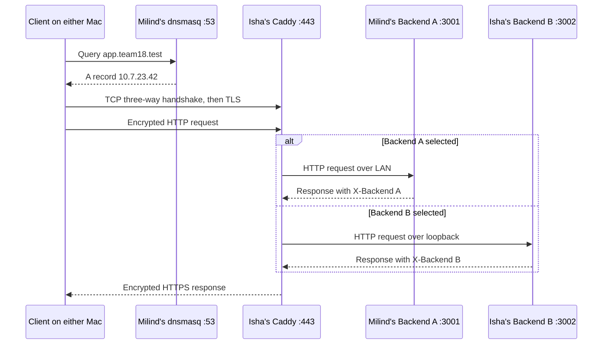

# Team 18 architecture

## Service placement

| Mac | Recorded address | Services | Owner |
| --- | --- | --- | --- |
| Milind's | `10.7.20.246` | dnsmasq on 53, Backend A on 3001, client verification | Milind |
| Isha's | `10.7.23.42` | Caddy on 443, Backend B on 3002 | Isha |

The recorded network is `10.7.0.0/19`, with gateway `10.7.0.1` and Wi-Fi
interface `en0` on Milind's Mac. Recheck DHCP addresses before using the
configuration. The [main README diagram](../README.md#architecture) shows
which services share each Mac.

## Request sequence

The client receives an A record for the proxy, not a backend address. Caddy
terminates TLS and makes a separate HTTP/1.1 connection to the selected
backend. Round-robin selection, active health checks every two seconds, and
upstream retry behavior are configured in the [Caddyfile](../phase1/configs/Caddyfile).

## DNS and trust

Both Macs use a scoped macOS resolver for `team18.test`; public Wi-Fi DNS
remains automatic. The [dnsmasq configuration](../phase1/configs/dnsmasq-team18.conf)
serves the exact project record and forwards other names to `8.8.8.8`.
The DNS configuration does not set a custom TTL.

The project uses Isha's mkcert certificate. Milind checked the public CA's
fingerprint before trusting it for SSL. Normal curl and Chrome checks
verified trust without bypassing certificate verification. The key and
certificate used by Caddy remain on Isha's Mac; see [TLS setup](tls-setup.md)
and the [certificate record](../phase1/tls/README.md).

## Cache and availability behavior

Each backend identifies itself through `X-Backend`. `/api/cache` sends a
60-second freshness lifetime and a backend-specific ETag. A conditional
request returns `304` only when its validator matches the selected backend's
representation. A B validator routed to A returns A's body with `200`.

The saved failure tests demonstrate B-only `200` responses when A was down,
and Caddy `503` when both backends were down. Separate tests cover an unknown
DNS name, an isolated wrong DNS answer, and unused proxy port 8443. Both
backends were restored after testing.

## Demo readiness

Recheck DHCP addresses, DNS, HTTPS trust, both direct backend ports, and
responses from both backend identities before recording.

The last follow-up verified Milind's recorded IP, dnsmasq, and Backend A;
Isha's recorded address answered ping while ports 22, 443, and 3002 timed
out. Her current IP and services still need confirmation. The earlier
intermittent Caddy route failure and untested reboot behavior are documented
in [proxy notes](tls-setup.md) and [DNS setup](dns-setup.md).

See [demo commands](demo-commands.md). The demo video will be added later.
